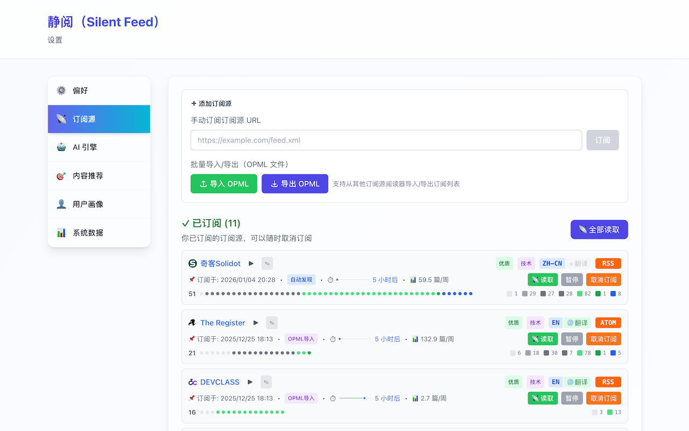

<div align="center">


# 🤫 Silent Feed

> 当前版本：`0.6.2`

**AI-powered RSS reader that learns what you love**

*让信息流安静下来 · Making the feed quieter*

[](https://chromewebstore.google.com/detail/pieiedlagbmcnooloibhigmidpakneca)
[](https://github.com/wxy/SilentFeed/releases)
[](LICENSE)


[English](#english) | [中文](#中文)

---

</div>

## English

### 🎯 What is Silent Feed?

Silent Feed is a **browser extension** that uses AI to understand what you're interested in by analyzing your browsing history, then automatically discovers and recommends RSS articles that match your interests.

**No more information overload. Just the content you care about.**

### ✨ Key Features

- **🤖 AI-Powered Recommendations** - Understands your interests from browsing behavior, powered by AI-generated interest summaries
- **🎯 AI Strategy Decision System** - Intelligent recommendation pool management with dynamic quality control
- **🔍 Auto RSS Discovery** - Finds RSS feeds from websites you visit, with complete Google Translate URL support
- **🎨 Visual Feed Management** - Colorful block progress bars showing article flow with semantic colors
- **📚 Read Later** - Save recommendations to Chrome's native reading list with one click
- **🌍 Feed-Level Translation** - Independent translation control for each RSS feed
- **🔒 Privacy First** - All data stays local, you control your API keys
- **⚡ Smart Engine Assignment** - Optimize cost by assigning different AI engines for different tasks (reduce costs by up to 95%)
- **📊 AI Usage Tracking** - Monitor API usage, tokens, and estimated costs
- **🌐 Bilingual** - Full support for English & 中文

### 📸 Screenshots

<div align="center">


<br/>
<em>AI-powered personalized recommendations with intelligent quality control</em>
<br/>


<br/>
<em>Visual feed management with colored blocks and feed-level translation control</em>
<br/>


<br/>
<em>AI-generated interest summary and preference features</em>
<br/>

</div>

### 🆕 What's New in v0.6.2

**Latest Release (2026-01-26)** - [Full Changelog](CHANGELOG.md)

- ✅ **Reading List Data Consistency** - Fixed data sync issues between Chrome Reading List, badge count, and settings stats
- 🌐 **Complete Internationalization** - All user-facing text now supports multiple languages
- 🔄 **Sync Strategy Optimization** - Enhanced three-layer sync mechanism for reliable updates

**Major Updates Since v0.3.6** (279 commits):

- 🤖 **AI-Generated Chinese Summaries** (v0.6.0) - Display AI summaries in reading list with 🤖 prefix
- 📝 **Full-Text Content Fetching** (v0.6.0) - Word count and reading time for longer articles
- 📚 **Reading List Mode** (v0.5.0) - Native Chrome Reading List integration with dedicated UI
- 🎯 **AI Strategy Decision System** (v0.5.1) - Intelligent quality control for recommendation optimization
- 🌍 **Feed-Level Translation Settings** (v0.5.1) - Independent translation control for each RSS feed
- 🎨 **Visual Feed Management** (v0.5.1) - Colorful block progress bars with semantic colors
- 🔧 **Google Translate URL Deduplication** (v0.5.1) - Complete fix for duplicate subscription issues

### 🚀 Get Started

1. **Install** - [Chrome Web Store](https://chromewebstore.google.com/detail/pieiedlagbmcnooloibhigmidpakneca)
2. **Browse** - Visit websites you like (100+ pages recommended)
3. **Configure AI** - Choose your preferred option:
   - **Option 1**: [Install Ollama](docs/OLLAMA_SETUP_GUIDE.md) for free local AI (recommended)
   - **Option 2**: Add your OpenAI/Anthropic/DeepSeek API key
4. **Enjoy** - Get personalized RSS recommendations

### 📚 Learn More

- 📖 **[User Guide](docs/USER_GUIDE.md)** - Complete usage documentation for users
  - [中文版本](docs/USER_GUIDE_ZH.md)
- 🤝 **[Contributing Guide](CONTRIBUTING.md)** - Development guide for contributors
  - [中文版本](CONTRIBUTING_ZH.md)
- 🔐 [Privacy Policy](PRIVACY.md) - How we protect your data
- 💡 [Product Overview](docs/PRD.md) - Product philosophy and vision

### 🛠️ For Developers

```bash
# Clone repository
git clone https://github.com/wxy/SilentFeed.git
cd SilentFeed

# Install dependencies
npm install

# Start development
npm run dev

# Run tests
npm test
```

See [Technical Documentation](docs/TDD.md) for architecture details.

### 📊 Project Status

- **Version**: 0.6.2 (Reading List Mode & Full i18n)
- **Status**: ✅ Released
- **Test Coverage**: 69%+ (2156 tests)
- **Commits since v0.3.6**: 279
- **Supported**: Chrome/Edge (Manifest V3)

### 💬 Community & Support

- 🐛 [Report Issues](https://github.com/wxy/SilentFeed/issues)
- 💡 [Feature Requests](https://github.com/wxy/SilentFeed/issues)
- ⭐ [Star this repo](https://github.com/wxy/SilentFeed) if you find it useful!

---

## 中文

### 🎯 Silent Feed 是什么？

Silent Feed 是一个**浏览器扩展**，通过分析你的浏览历史，用 AI 理解你的兴趣，然后自动发现和推荐符合你兴趣的 RSS 文章。

**不再信息过载，只看你真正关心的内容。**

### ✨ 核心功能

- **🤖 AI 智能推荐** - 从浏览行为理解你的兴趣，基于 AI 生成的兴趣总结
- **🎯 AI 策略决策系统** - 智能推荐池管理，动态质量控制
- **🔍 自动发现订阅源** - 从你访问的网站发现 RSS，完整支持 Google 翻译链接
- **🎨 可视化源管理** - 彩色方块进度条，语义化颜色展示文章流
- **📚 稍后阅读** - 一键保存推荐到 Chrome 原生阅读列表
- **🌍 源级翻译设置** - 每个订阅源可独立控制翻译
- **🔒 隐私优先** - 数据本地存储，你掌控 API 密钥
- **⚡ 智能引擎分配** - 为不同任务分配不同 AI 引擎，优化成本（最高节省 95% 费用）
- **📊 AI 用量追踪** - 监控 API 使用量、Token 和预估费用
- **🌐 双语支持** - 完整支持 English & 中文

### 📸 截图

<div align="center">


<br/>
<em>AI 驱动的个性化推荐，智能质量控制</em>
<br/>


<br/>
<em>彩色方块可视化源管理，源级翻译控制</em>
<br/>


<br/>
<em>AI 生成的兴趣总结和偏好特征</em>
<br/>

</div>

### 🆕 v0.6.2 版本更新

**最新发布 (2026-01-26)** - [完整变更日志](CHANGELOG.md)

- ✅ **清单数据一致性** - 修复 Chrome 清单、徽章计数和设置统计之间的数据同步问题
- 🌐 **完整国际化** - 所有用户可见文本现在都支持多语言
- 🔄 **同步策略优化** - 增强三层同步机制，确保数据更新可靠

**自 v0.3.6 以来的主要更新**（279 次提交）：

- 🤖 **AI 中文摘要** (v0.6.0) - 在阅读列表中显示 AI 摘要，带 🤖 前缀
- 📝 **全文内容抓取** (v0.6.0) - 显示长文章的字数和阅读时间
- 📚 **阅读列表模式** (v0.5.0) - 原生 Chrome 阅读列表集成，专用 UI
- 🎯 **AI 策略决策系统** (v0.5.1) - 智能质量控制优化推荐
- 🌍 **Feed 级翻译设置** (v0.5.1) - 每个订阅源可独立控制翻译
- 🎨 **可视化 Feed 管理** (v0.5.1) - 彩色方块进度条，语义化颜色
- 🔧 **Google Translate URL 去重** (v0.5.1) - 完全修复重复订阅问题

### 🚀 快速开始

1. **安装扩展** - [Chrome 应用商店](https://chromewebstore.google.com/detail/pieiedlagbmcnooloibhigmidpakneca)
2. **浏览网页** - 访问你喜欢的网站（建议 100+ 页面）
3. **配置 AI** - 选择你喜欢的方式：
   - **方式一**：[安装 Ollama](docs/OLLAMA_SETUP_GUIDE.md) 获得免费本地 AI（推荐）
   - **方式二**：添加你的 OpenAI/Anthropic/DeepSeek API 密钥
4. **开始使用** - 获取个性化 RSS 推荐

### 📚 了解更多

- 📖 **[用户手册](docs/USER_GUIDE_ZH.md)** - 面向用户的完整使用文档
  - [English Version](docs/USER_GUIDE.md)
- 🤝 **[贡献指南](CONTRIBUTING_ZH.md)** - 面向开发者的开发指南
  - [English Version](CONTRIBUTING.md)
- 🔐 [隐私政策](PRIVACY.md) - 我们如何保护你的数据
- 💡 [产品概述](docs/PRD.md) - 产品理念和愿景

### 🛠️ 开发者

```bash
# 克隆仓库
git clone https://github.com/wxy/SilentFeed.git
cd SilentFeed

# 安装依赖
npm install

# 启动开发
npm run dev

# 运行测试
npm test
```

详见[技术文档](docs/TDD.md)了解架构细节。

### 📊 项目状态

- **版本**: 0.6.2（清单模式优化与国际化增强）
- **状态**: ✅ 已发布
- **测试覆盖率**: 69%+（2156 个测试）
- **自 v0.3.6 提交数**: 279
- **支持浏览器**: Chrome/Edge (Manifest V3)

### 💬 社区与支持

- 🐛 [报告问题](https://github.com/wxy/SilentFeed/issues)
- 💡 [功能建议](https://github.com/wxy/SilentFeed/issues)
- ⭐ 如果觉得有用，请给我们一个 [Star](https://github.com/wxy/SilentFeed)！

---

<div align="center">

**Made with ❤️ by Silent Feed Team**

[Website](https://github.com/wxy/SilentFeed) · [Report Bug](https://github.com/wxy/SilentFeed/issues) · [Request Feature](https://github.com/wxy/SilentFeed/issues)

</div>
