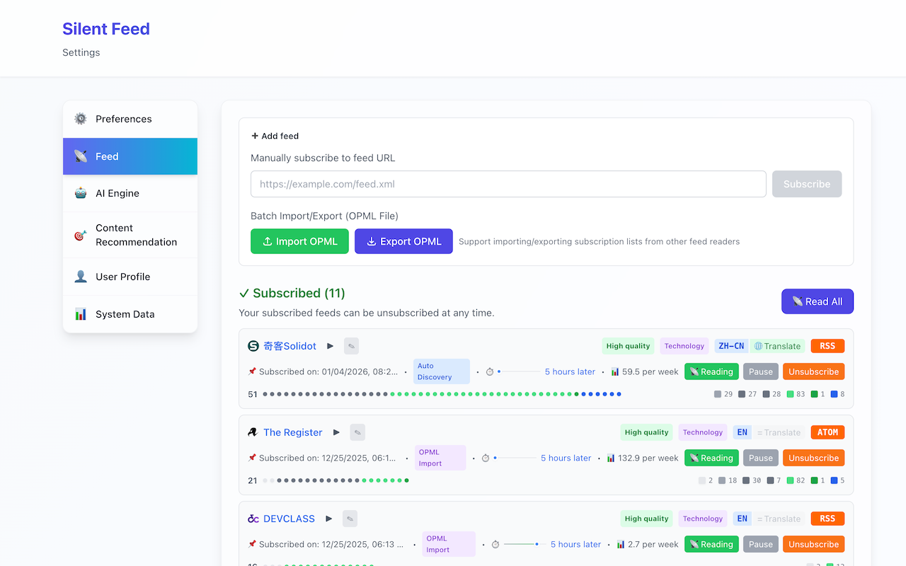

# 🤫 Silent Feed

<div align="center">


**AI-powered RSS reader that learns what you love**

*Making the feed quieter*

[](https://chromewebstore.google.com/detail/pieiedlagbmcnooloibhigmidpakneca)
[](https://github.com/wxy/SilentFeed/releases)
[](LICENSE)


> Current Version: `0.6.2` | [中文](README_CN.md) | [Home](README.md)

---

</div>

## 🎯 What is Silent Feed?

Silent Feed is a **browser extension** that uses AI to understand what you're interested in by analyzing your browsing history, then automatically discovers and recommends RSS articles that match your interests.

**No more information overload. Just the content you care about.**

## ✨ Key Features

- **🤖 AI-Powered Recommendations** - Understands your interests from browsing behavior, powered by AI-generated interest summaries
- **🎯 AI Strategy Decision System** - Intelligent recommendation pool management with dynamic quality control
- **🔍 Auto RSS Discovery** - Finds RSS feeds from websites you visit, with complete Google Translate URL support
- **🎨 Visual Feed Management** - Colorful block progress bars showing article flow with semantic colors
- **📚 Read Later** - Save recommendations to Chrome's native reading list with one click
- **🌍 Feed-Level Translation** - Independent translation control for each RSS feed
- **🔒 Privacy First** - All data stays local, you control your API keys
- **⚡ Smart Engine Assignment** - Optimize cost by assigning different AI engines for different tasks (reduce costs by up to 95%)
- **📊 AI Usage Tracking** - Monitor API usage, tokens, and estimated costs
- **🌐 Bilingual** - Full support for English & 中文

## 📸 Screenshots

<div align="center">


<br/>
<em>AI-powered personalized recommendations with intelligent quality control</em>
<br/><br/>


<br/>
<em>Visual feed management with colored blocks and feed-level translation control</em>
<br/><br/>


<br/>
<em>AI-generated interest summary and preference features</em>
<br/>

</div>

## 🆕 What's New in v0.6.2

**Latest Release (2026-01-26)** - [Full Changelog](CHANGELOG.md)

- ✅ **Reading List Data Consistency** - Fixed data sync issues between Chrome Reading List, badge count, and settings stats
- 🌐 **Complete Internationalization** - All user-facing text now supports multiple languages
- 🔄 **Sync Strategy Optimization** - Enhanced three-layer sync mechanism for reliable updates

**Major Updates Since v0.3.6** (279 commits):

- 🤖 **AI-Generated Chinese Summaries** (v0.6.0) - Display AI summaries in reading list with 🤖 prefix
- 📝 **Full-Text Content Fetching** (v0.6.0) - Word count and reading time for longer articles
- 📚 **Reading List Mode** (v0.5.0) - Native Chrome Reading List integration with dedicated UI
- 🎯 **AI Strategy Decision System** (v0.5.1) - Intelligent quality control for recommendation optimization
- 🌍 **Feed-Level Translation Settings** (v0.5.1) - Independent translation control for each RSS feed
- 🎨 **Visual Feed Management** (v0.5.1) - Colorful block progress bars with semantic colors
- 🔧 **Google Translate URL Deduplication** (v0.5.1) - Complete fix for duplicate subscription issues

## 🚀 Get Started

1. **Install** - [Chrome Web Store](https://chromewebstore.google.com/detail/pieiedlagbmcnooloibhigmidpakneca)
2. **Browse** - Visit websites you like (100+ pages recommended)
3. **Configure AI** - Choose your preferred option:
   - **Option 1**: [Install Ollama](docs/OLLAMA_SETUP_GUIDE.md) for free local AI (recommended)
   - **Option 2**: Add your OpenAI/Anthropic/DeepSeek API key
4. **Enjoy** - Get personalized RSS recommendations

## 📚 Learn More

- 📖 **[User Guide](docs/USER_GUIDE.md)** - Complete usage documentation for users
  - [中文版本](docs/USER_GUIDE_ZH.md)
- 🤝 **[Contributing Guide](CONTRIBUTING.md)** - Development guide for contributors
  - [中文版本](CONTRIBUTING_ZH.md)
- 🔐 [Privacy Policy](PRIVACY.md) - How we protect your data
- 💡 [Product Overview](docs/PRD.md) - Product philosophy and vision

## 🛠️ For Developers

```bash
# Clone repository
git clone https://github.com/wxy/SilentFeed.git
cd SilentFeed

# Install dependencies
npm install

# Start development
npm run dev

# Run tests
npm test
```

See [Technical Documentation](docs/TDD.md) for architecture details.

## 📊 Project Status

- **Version**: 0.6.2 (Reading List Mode & Full i18n)
- **Status**: ✅ Released
- **Test Coverage**: 69%+ (2156 tests)
- **Commits since v0.3.6**: 279
- **Supported**: Chrome/Edge (Manifest V3)

## 💬 Community & Support

- 🐛 [Report Issues](https://github.com/wxy/SilentFeed/issues)
- 💡 [Feature Requests](https://github.com/wxy/SilentFeed/issues)
- ⭐ [Star this repo](https://github.com/wxy/SilentFeed) if you find it useful!

---

<div align="center">

**Made with ❤️ by Silent Feed Team**

[Website](https://github.com/wxy/SilentFeed) · [Report Bug](https://github.com/wxy/SilentFeed/issues) · [Request Feature](https://github.com/wxy/SilentFeed/issues)

</div>
