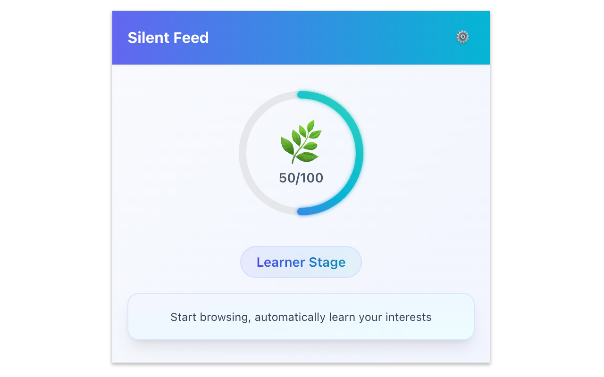
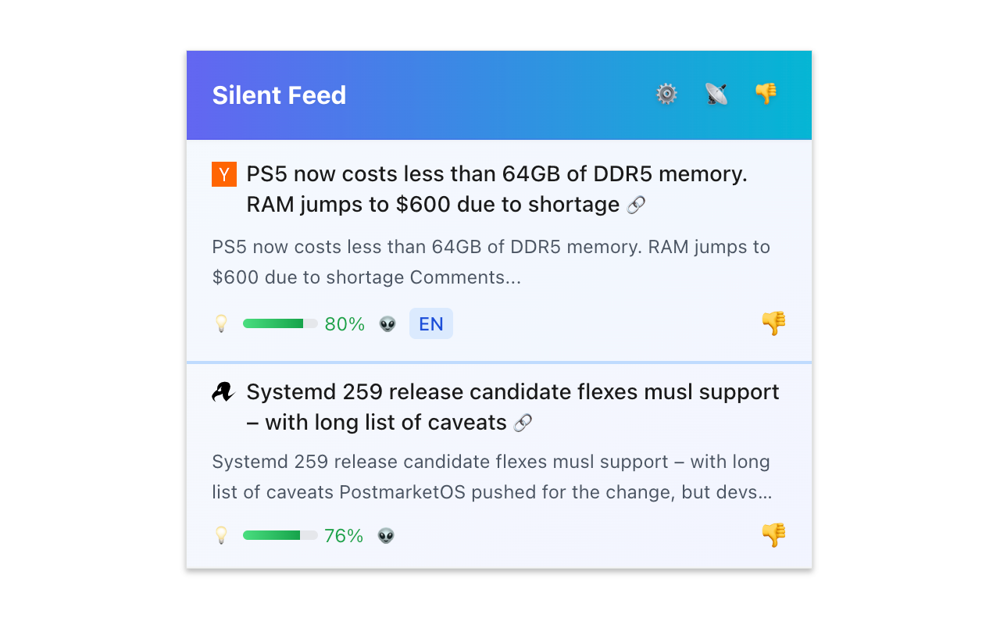
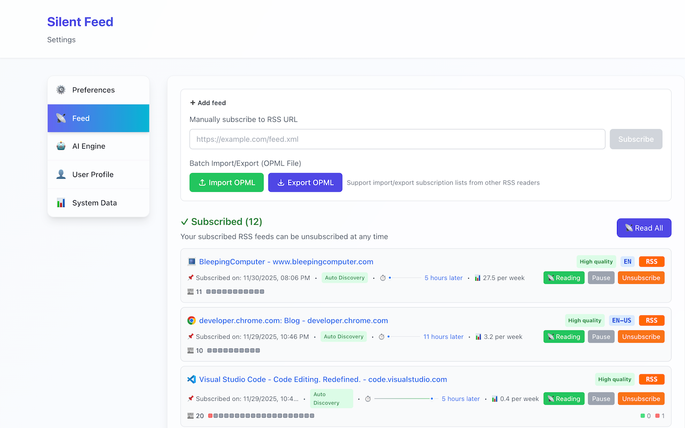
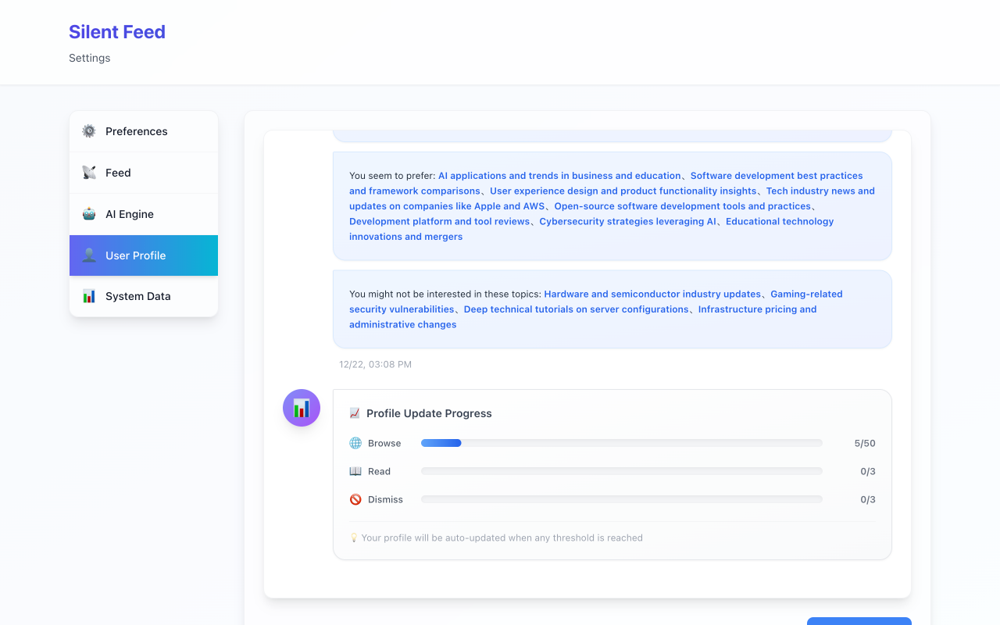
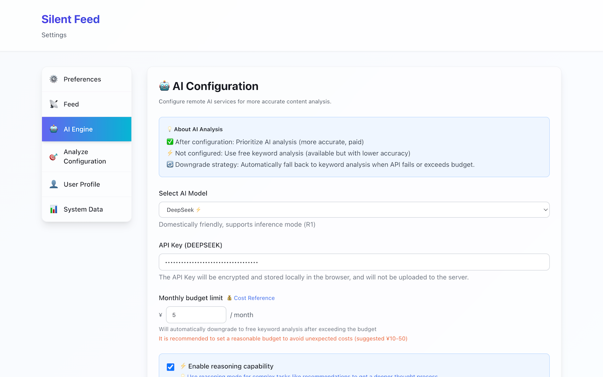

# Silent Feed User Guide

> 📖 **中文用户手册**: [USER_GUIDE_ZH.md](USER_GUIDE_ZH.md)

---

## 📋 Table of Contents

1. [Installation](#installation)
2. [First Time Use](#first-time-use)
3. [Core Features](#core-features)
4. [Advanced Settings](#advanced-settings)
5. [FAQ](#faq)
6. [Privacy](#privacy)

---

## Installation

### Method 1: From Chrome Web Store (Recommended)

1. Visit [Silent Feed - Chrome Web Store](https://chromewebstore.google.com/detail/pieiedlagbmcnooloibhigmidpakneca)
2. Or search "Silent Feed" in Chrome Web Store
3. Click "Add to Chrome"
4. Confirm permissions
5. Onboarding page opens automatically

### Method 2: Developer Mode (Current)

1. **Download Extension Package**
   - Visit [GitHub Releases](https://github.com/wxy/SilentFeed/releases)
   - Download latest `chrome-mv3-prod-v0.3.6.zip`
   - Extract to any directory

2. **Load to Chrome**
   - Open Chrome browser
   - Enter `chrome://extensions/` in address bar
   - Enable "Developer mode" (top right)
   - Click "Load unpacked"
   - Select extracted directory

3. **Verify Installation**
   - Extension icon appears in toolbar
   - Click icon to view popup (first time will guide configuration)

---

## First Time Use

### Onboarding Process

After installation, extension opens onboarding page automatically:

**Step 1: Welcome**
- Learn about Silent Feed's philosophy
- View main features
- Click "Next" to continue

**Step 2: AI Configuration**
- Choose AI provider (OpenAI / Anthropic / DeepSeek)
- Input your API Key
- Test connection to ensure configuration is correct
- **Note**: AI configuration is required for recommendation feature

**Step 3: RSS Subscriptions (Optional)**
- Add your favorite RSS feeds
- Import OPML file
- Quick add sample feeds
- **Or configure later**

**Step 4: Complete**
- Start browsing normally
- Extension collects data in background
- Recommendations start after 100 pages

### Cold Start Process

Silent Feed needs **100 valid page visits** before full recommendations:

- **What is a valid page?**
  - Dwell time > 30 seconds
  - Non-sensitive domains (excludes banking, medical, etc.)
  - Contains sufficient text content

- **Check Progress**
  - Click extension icon
  - View countdown: X pages remaining
  - View current data statistics

- **Why 100 pages?**
  - Build accurate interest profile
  - Identify main interest topics
  - Extract keyword features
  - Ensure recommendation quality

   
    
   <em>Cold start progress and learning status</em>
    

---

## Core Features

### 1. View Recommendations

**Open Recommendations**
- Click extension icon
- Or use keyboard shortcut (configurable in settings)

**Recommendation Interface**
- Shows 3-5 recommendations each time
- Recommendation score: 0-100% (higher = better match)
- Recommendation engine: 🧮 Algorithm / 🤖 AI / 👽 Reasoning AI
- Reasoning: Why this article is recommended

**Article Actions**
- **Read**: Click title to open article
- **Not Interested**: Mark as "disliked", skip
- **Read Later**: Save to Chrome Reading List (click bookmark icon)

   
    
   <em>Personalized AI-powered recommendations</em>
    

### 2. Manage RSS Subscriptions

**Open Settings Page**
1. Right-click extension icon
2. Select "Options"
3. Enter "RSS Settings" tab

**Add Feed**
- **Method 1**: Input RSS feed URL
- **Method 2**: Click extension icon on page with RSS (auto-detect)
- **Method 3**: Import OPML file

**Manage Feeds**
- View all subscriptions
- View statistics (article count, fetch frequency)
- Pause/resume subscription
- Delete feed

**OPML Import/Export**
- Import: Migrate from other RSS readers
- Export: Backup your subscriptions

   
    
   <em>Manage feeds, stats, and OPML import/export</em>
    

### 3. View Interest Profile

**Open Profile Page**
1. Enter settings page
2. Select "Profile Settings" tab

**Profile Information** (Updated in v0.2.0)
- **AI Interest Summary**: Natural language description of your interests generated by AI
- **Preference Features**: Key characteristics AI identified from your browsing behavior
- **Avoid Topics**: Topics you've marked as "Not Interested"
- **Browsing Statistics**: Total pages, valid pages, last analysis time

> **Note**: Starting from v0.2.0, Silent Feed focuses on AI-generated profiles. Keyword-based visualizations (topic distribution, keyword cloud, evolution timeline) have been removed to emphasize AI capabilities.

**Profile Actions**
- **Rebuild Profile**: Re-analyze based on current data
- **Clear History**: Delete all browsing data (caution)

   
    
   <em>AI-generated interest summary and preferences</em>
    

### 4. Configure AI

**AI Engine Selection**
- **DeepSeek Chat** (Recommended): Low cost (¥0.001/article), great performance
- **DeepSeek Reasoner**: Deep reasoning mode, higher cost (¥0.01/article)
- **Local AI**: Completely free, self-deployed ChatGPT API compatible service
- **OpenAI**: GPT-4o / GPT-4o-mini
- **Anthropic**: Claude 3.5

**Configuration Steps**
1. Select AI engine
2. Input API Key
   - DeepSeek: Get from [platform.deepseek.com](https://platform.deepseek.com)
   - OpenAI: Get from [platform.openai.com](https://platform.openai.com)
3. Click "Test Connection"
4. Save configuration

**Security Features** (New in v0.3.x)
- 🔐 API keys encrypted with AES-GCM-256
- 🔑 Unique encryption key per browser instance
- 🛡️ Sensitive data never stored in plaintext

**Cost Control** (Enhanced in v0.3.x)
- View real-time AI cost statistics
- View daily/monthly usage
- Set provider-level budget limits (supports USD/CNY)
- AI usage visualization dashboard

**Resilience Mechanisms** (New in v0.3.x)
- Auto-retry: Exponential backoff strategy (up to 3 times)
- Circuit breaker: Pause requests after consecutive failures
- Timeout control: Configurable timeout per provider

   
    
   <em>Configure providers, test connection, and choose models</em>
    

---

## Advanced Settings

### Preferences

- **Auto-translate Recommendations**: Translate non-UI language recommendations to UI language
- **Notification Settings**: Configure desktop notification rules
- **Theme**: Follow system / Dark / Light
- **Language**: 中文 / English

### AI Engine Assignment

**Feature**: Assign different AI engines for different task types to balance cost and performance.

**Configuration**:
- Changes are saved automatically when you modify engine assignments
- No need to manually click save button
- Immediate effect on new AI tasks

**Task Types**:

1. **Page Browsing Analysis**: Analyze web pages you visit (high frequency)
2. **Feed Article Analysis**: Evaluate RSS article quality and relevance (high frequency)
3. **User Profile Generation**: Generate interest profile summary (low frequency)

**Available Engines**:

- **DeepSeek AI**: Cheap and fast, ideal for high-frequency tasks (recommended)
- **OpenAI GPT**: High accuracy, suitable for important tasks
- **Ollama Local**: Completely free, requires local deployment

**Preset Plans**:

1. **Intelligence First** (default):
   - All tasks use DeepSeek
   - Profile generation enables reasoning mode
   - Cost: ~$0.15/month

2. **Balanced**:
   - Page analysis uses DeepSeek
   - Feed analysis and profile generation use OpenAI
   - Cost: ~$0.54/month

3. **Privacy First**:
   - All tasks use local Ollama
   - Cost: $0 (requires local deployment)

**Advanced Customization**:

You can independently select engine and enable reasoning mode for each task:

- **Engine Selection**: DeepSeek / OpenAI / Ollama
- **Reasoning Mode**: More accurate when enabled, but slightly slower and costlier

**Usage Recommendations**:

- Beginners: Choose "Intelligence First" preset, low cost and good results
- Quality Seekers: Choose "Balanced" plan, use OpenAI for important tasks
- Privacy Conscious: Choose "Privacy First", but requires local Ollama deployment
- Advanced Users: Custom configuration for fine-grained control

### Analysis Settings

- **Recommendation Count**: Articles per recommendation (3-10)
- **Analysis Engine**:
  - For recommendations: Generate recommendations
  - For feeds: Analyze RSS article quality
- **Update Frequency**: RSS fetch interval

### Data Management

**System Statistics** (Added in v0.2.0)
- **RSS Article Count**: Total articles from all subscriptions
- **Recommendation Funnel**: Visualize content filtering process
  - RSS Total → Analyzed → Recommended → Read/Rejected
  - Conversion Rates: Analysis rate, recommendation rate, reading rate
  - Helps you understand how Silent Feed filters content for you

**Data Actions**
- **Export Data**: Export browsing history, profile, subscriptions
- **Import Data**: Restore from backup
- **Clear Data**: Delete all data (caution)

---

## FAQ

### Q: Why 100 pages required for recommendations?

A: Building an accurate interest profile requires sufficient data samples. 100 pages is the tested minimum threshold ensuring recommendation quality. You can check current progress in settings.

### Q: How does AI engine assignment affect cost?

A: Different engines have vastly different costs:
- DeepSeek: Cheapest (~$0.001/1K tokens)
- OpenAI GPT-4o-mini: Medium (~$0.015/1K tokens)
- Ollama: Free (runs locally)

Using cheap engines for high-frequency tasks (page analysis, feed analysis) significantly reduces costs. Typical user monthly costs:
- Intelligence First: ~$0.15
- Balanced: ~$0.54
- Privacy First: $0

### Q: What's the difference with reasoning mode?

A: Reasoning mode makes AI think deeply:
- Advantages: More accurate results, better logic
- Disadvantages: Slightly slower, higher cost (about 1.5-2x)

Recommendations:
- Page analysis: Disable reasoning (needs speed)
- Feed analysis: Optional (depends on budget)
- Profile generation: Enable reasoning (low frequency and important)

### Q: Is my browsing data secure?

A: Completely secure. All data is stored locally in your browser (IndexedDB) by default, not uploaded to any server. When using AI recommendations, only necessary feature data (keywords, topic scores) is sent, not URLs or sensitive information.

### Q: Can I use free AI?

A: Yes. You can self-deploy local AI service (e.g., Ollama + LLaMA), as long as it's ChatGPT API compatible. This is completely free and more private.

### Q: How much does AI recommendation cost?

A: Using DeepSeek Chat as example, about ¥0.001 per article. Recommending 5 articles daily, monthly cost is about ¥0.15. You can also use local AI service for completely free.

### Q: How to import subscriptions from other RSS readers?

A: Most RSS readers support OPML export. After exporting, import in Silent Feed settings.

### Q: What if recommendations are inaccurate?

A: 1) Ensure sufficient browsing data collected (>100 pages); 2) Click "Not Interested" to help AI learn; 3) Rebuild profile in settings; 4) Try different AI engines.

### Q: How to uninstall extension?

A: Go to `chrome://extensions/`, find Silent Feed, click "Remove". All local data will be deleted.

---

## Privacy

### Our Commitment

- ✅ **Local First**: All analysis done locally by default
- ✅ **Data Control**: You fully control data storage and deletion
- ✅ **Transparent Open Source**: Code is open source, auditable
- ✅ **Minimal Permissions**: Only request necessary permissions

### Data Collected

**Local Storage** (not uploaded):
- Browsing history (URL, title, visit time, dwell time)
- User profile (topic scores, keyword weights)
- RSS subscriptions and articles
- Recommendation records

**Sent When Using AI** (if using DeepSeek/OpenAI, etc.):
- User profile features (topic scores, keywords)
- Article metadata (title, summary)
- **NOT included**: Browsing URLs, personal identifiable information

### Permission Explanation

- `tabs`: Detect RSS feeds on current page
- `storage`: Store configurations and data
- `alarms`: Schedule RSS fetching
- `notifications`: Desktop notifications
- `https://*/*`: Fetch RSS content

### Data Deletion

Can delete anytime in settings:
- Partial data (e.g., browsing history)
- Complete data (reset extension)
- Uninstall extension (auto-delete all data)

---

**Questions? Contact Us**

[GitHub Issues](https://github.com/wxy/SilentFeed/issues) | [Email](mailto:xingyu.wang@gmail.com)

