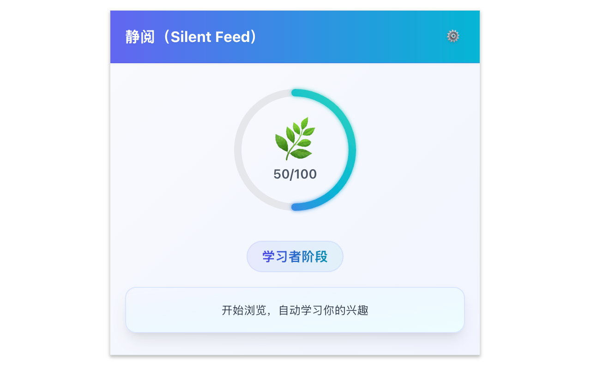
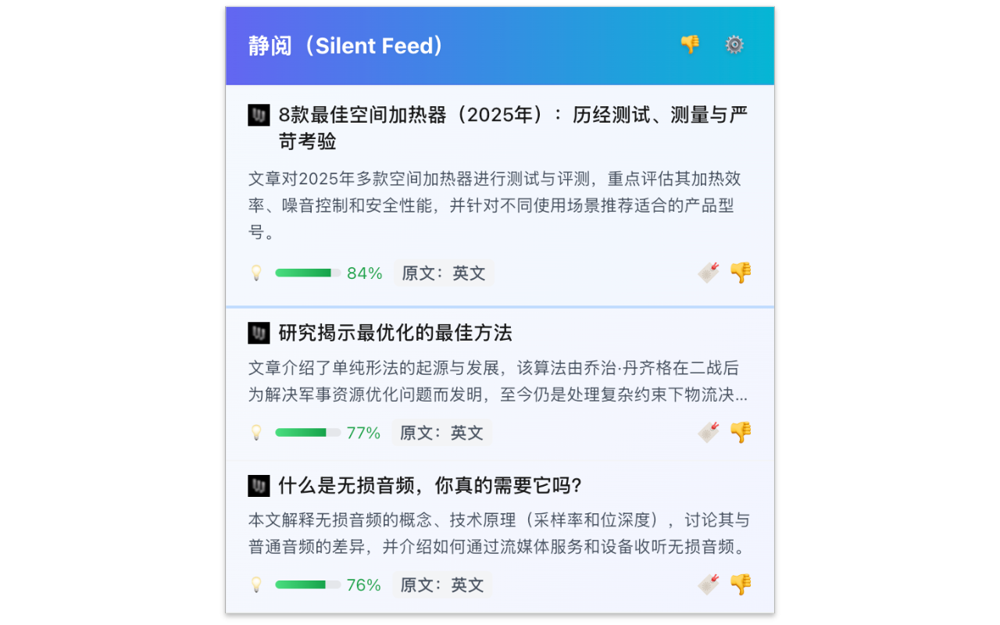
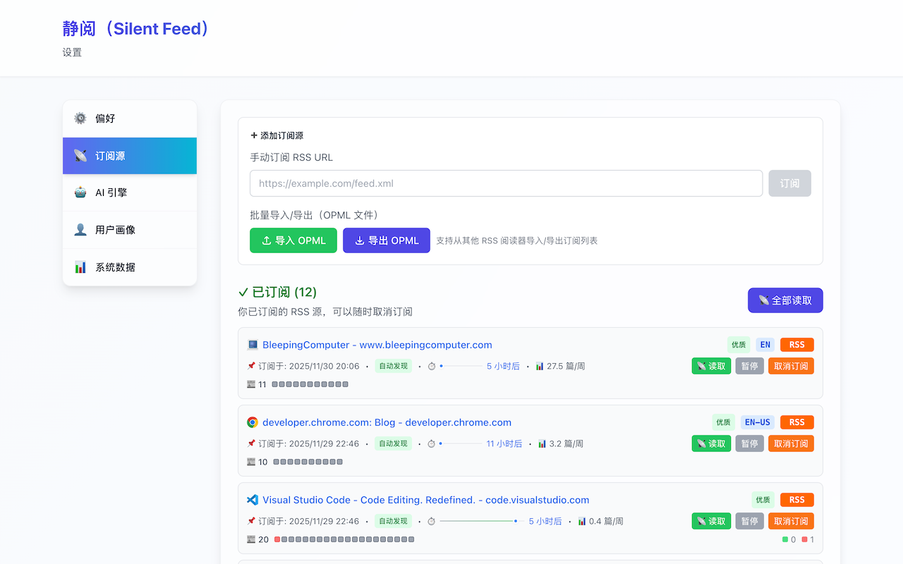
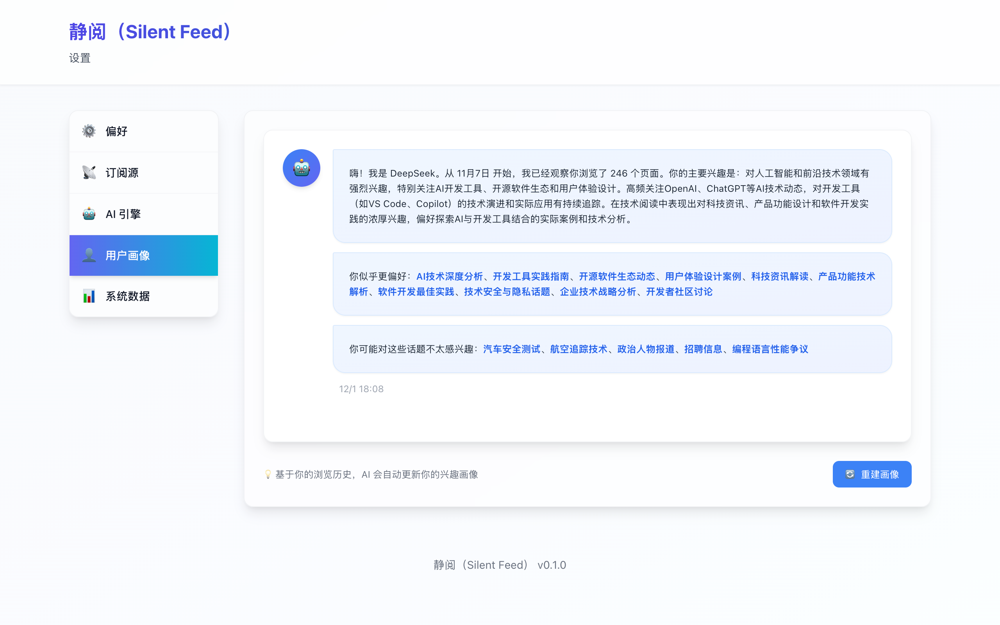
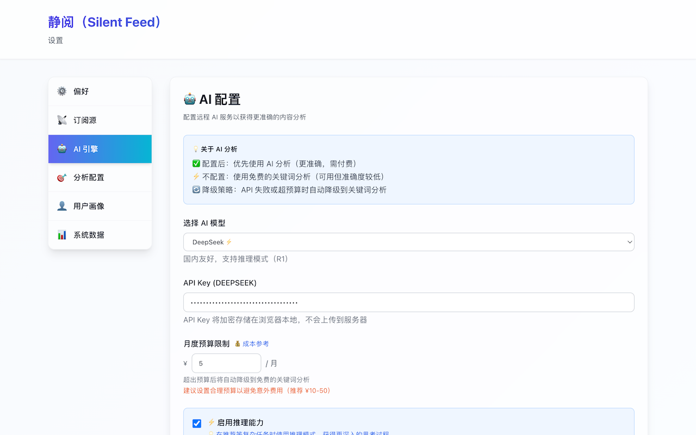

# Silent Feed 用户手册

> 📖 **English User Guide**: [USER_GUIDE.md](USER_GUIDE.md)

---

## 📋 目录

1. [安装指南](#安装指南)
2. [首次使用](#首次使用)
3. [核心功能](#核心功能)
4. [高级设置](#高级设置)
5. [常见问题](#常见问题)
6. [隐私说明](#隐私说明)

> 💡 **图标状态指南**：想了解扩展图标各种状态的含义？请查看 [图标状态说明](icon-states-guide.html)

---

## 安装指南

### 方式 1：从 Chrome Web Store 安装（推荐）

1. 访问 [Silent Feed - Chrome Web Store](https://chromewebstore.google.com/detail/pieiedlagbmcnooloibhigmidpakneca)
2. 或在 Chrome Web Store 搜索 "Silent Feed"
3. 点击"添加至 Chrome"按钮
4. 确认权限请求
5. 安装完成后会自动打开引导页面

### 方式 2：开发者模式安装（当前可用）

1. **下载扩展包**
   - 访问 [GitHub Releases](https://github.com/wxy/SilentFeed/releases)
   - 下载最新版本的 `chrome-mv3-prod-v0.3.6.zip`
   - 解压到任意目录

2. **加载到 Chrome**
   - 打开 Chrome 浏览器
   - 在地址栏输入 `chrome://extensions/` 并回车
   - 开启右上角的"开发者模式"开关
   - 点击"加载已解压的扩展程序"按钮
   - 选择刚才解压的目录

3. **验证安装**
   - 扩展图标应该出现在浏览器工具栏
   - 点击图标查看弹窗（初次使用会引导配置）

---

## 首次使用

### 引导流程

安装完成后，扩展会自动打开引导页面，帮助你完成初始配置：

**步骤 1：欢迎页面**
- 了解 Silent Feed 的核心理念
- 查看主要功能介绍
- 点击"下一步"继续

**步骤 2：AI 配置**
- 选择 AI 提供商（OpenAI / Anthropic / DeepSeek）
- 输入你的 API Key
- 测试连接确保配置正确
- **注意**：AI 配置是推荐功能的必要条件

**步骤 3：RSS 订阅（可选）**
- 添加你喜欢的 RSS 源
- 导入 OPML 文件
- 快速添加示例源
- **或者稍后配置**

**步骤 4：完成**
- 开始正常浏览网页
- 扩展在后台收集数据
- 100 页面后开始推荐

### 冷启动过程

Silent Feed 需要收集 **100 个有效页面访问** 才能建立完整的兴趣画像：

- **什么是有效页面？**
  - 停留时间 > 30 秒
  - 非敏感域名（排除银行、医疗等）
  - 包含足够的文本内容

- **查看进度**
  - 点击扩展图标
  - 查看倒计数：剩余 X 页面
  - 查看当前收集的数据统计

- **为什么需要 100 页面？**
  - 构建准确的兴趣画像
  - 识别主要兴趣主题
  - 提取关键词特征
  - 确保推荐质量

   
    
   <em>冷启动学习进度与状态</em>
    

---

## 核心功能

### 1. 查看推荐

**打开推荐界面**
- 点击扩展图标
- 或使用快捷键（可在设置中配置）

**推荐界面说明**
- 每次显示 3-5 条推荐
- 推荐分数：0-100%（越高越匹配）
- 推荐引擎：🧮 算法 / 🤖 AI / 👽 推理 AI
- 推荐理由：查看为什么推荐这篇文章

**文章操作**
- **阅读**：点击标题打开原文
- **不想读**：标记为"不感兴趣"，跳过这篇
- **稍后读**：保存到 Chrome 阅读列表（点击书签图标）

   
    
   <em>AI 驱动的个性化推荐</em>
    

### 2. 管理 RSS 订阅

**打开设置页面**
1. 右键点击扩展图标
2. 选择"选项"
3. 进入"RSS 设置"标签

**添加订阅源**
- **方式 1**：输入 RSS 源 URL
- **方式 2**：在包含 RSS 的网页上点击扩展图标，自动检测
- **方式 3**：导入 OPML 文件

**管理订阅源**
- 查看所有订阅列表
- 查看订阅统计（文章数、抓取频率）
- 暂停/恢复订阅
- 删除订阅源

**OPML 导入/导出**
- 导入：从其他 RSS 阅读器迁移
- 导出：备份你的订阅列表

   
    
   <em>管理订阅、查看统计、导入导出 OPML</em>
    

### 3. 查看兴趣画像

**打开画像页面**
1. 进入设置页面
2. 选择"画像设置"标签

**画像信息**（v0.2.0 更新）
- **AI 兴趣总结**：AI 生成的自然语言兴趣描述
- **偏好特征**：AI 从浏览行为中识别的关键特征
- **避免主题**：您标记为"不想读"的主题
- **浏览统计**：总页面数、有效页面数、最后分析时间

> **注意**：从 v0.2.0 开始，Silent Feed 专注于 AI 生成的画像。基于关键字的可视化（主题分布图、关键词云、演化历程）已移除，以强调 AI 能力。

**画像操作**
- **重建画像**：基于当前数据重新分析
- **清空历史**：删除所有浏览数据（谨慎）

   
    
   <em>AI 生成的兴趣总结与偏好要点</em>
    

### 4. 配置 AI

**AI 引擎选择**
- **DeepSeek Chat**（推荐）：成本低（¥0.001/篇），效果好
- **DeepSeek Reasoner**：深度推理模式，成本较高（¥0.01/篇）
- **本地 AI**：完全免费，自部署兼容 ChatGPT API 的服务
- **OpenAI**：GPT-4o / GPT-4o-mini
- **Anthropic**：Claude 3.5

**配置步骤**
1. 选择 AI 引擎
2. 输入 API Key
   - DeepSeek: 从 [platform.deepseek.com](https://platform.deepseek.com) 获取
   - OpenAI: 从 [platform.openai.com](https://platform.openai.com) 获取
3. 点击"测试连接"
4. 保存配置

**安全特性**（v0.3.x 新增）
- 🔐 API 密钥使用 AES-GCM-256 加密存储
- 🔑 每个浏览器实例生成独立密钥
- 🛡️ 敏感信息不会明文存储

**成本控制**（v0.3.x 增强）
- 查看实时 AI 成本统计
- 查看每日/每月使用量
- 设置 Provider 级别预算上限（支持 USD/CNY）
- AI 用量可视化仪表盘

**容错机制**（v0.3.x 新增）
- 自动重试：指数退避策略（最多 3 次）
- 熔断保护：连续失败后暂停请求
- 超时控制：每个 Provider 可配置超时时间

   
    
   <em>配置厂商、测试连接、选择模型</em>
    

---

## 高级设置

### 偏好设置

- **自动翻译推荐**：将非界面语言的推荐翻译为界面语言
- **通知设置**：配置桌面通知规则
- **主题**：跟随系统 / 深色 / 浅色
- **语言**：中文 / English

### AI 引擎分配

**功能说明**：为不同任务类型分配不同的 AI 引擎，实现成本与性能的平衡。

**配置方式**：
- 修改引擎分配时自动保存
- 无需手动点击保存按钮
- 立即对新的 AI 任务生效

**任务类型**：

1. **页面浏览学习**：分析你浏览的网页内容（高频任务）
2. **订阅源文章分析**：评估 RSS 文章质量和相关性（高频任务）
3. **用户画像生成**：生成兴趣画像摘要（低频任务）

**可选引擎**：

- **DeepSeek AI**：便宜快速，适合高频任务（推荐）
- **OpenAI GPT**：准确度高，适合重要任务
- **Ollama 本地**：完全免费，需本地部署

**预设方案**：

1. **智能优先**（默认）：
   - 所有任务使用 DeepSeek
   - 用户画像生成开启推理模式
   - 成本：~$0.15/月

2. **平衡方案**：
   - 页面分析用 DeepSeek
   - 订阅源分析和画像生成用 OpenAI
   - 成本：~$0.54/月

3. **隐私优先**：
   - 所有任务使用本地 Ollama
   - 成本：$0（需要本地部署）

**高级自定义**：

可以为每个任务独立选择引擎和是否开启推理模式：

- **引擎选择**：DeepSeek / OpenAI / Ollama
- **推理模式**：开启后更准确，但速度稍慢且成本稍高

**使用建议**：

- 初学者：选择"智能优先"预设，成本低且效果好
- 追求质量：选择"平衡方案"，重要任务用 OpenAI
- 注重隐私：选择"隐私优先"，但需要本地部署 Ollama
- 高级用户：自定义配置，精细控制每个任务

### 分析设置

- **推荐数量**：每次推荐的文章数（3-10）
- **分析引擎**：
  - 用于推荐：生成推荐时使用
  - 用于订阅源：分析 RSS 文章质量
- **更新频率**：RSS 抓取间隔

### 数据管理

**系统统计**（v0.2.0 新增）
- **RSS 文章总数**：所有订阅源的文章总数
- **推荐筛选漏斗**：可视化内容筛选流程
  - RSS 总数 → 已分析 → 已推荐 → 已读/不想读
  - 转化率统计：分析率、推荐率、阅读率
  - 帮助您理解 Silent Feed 如何为您筛选内容

**数据操作**
- **导出数据**：导出浏览历史、画像、订阅等
- **导入数据**：从备份恢复
- **清空数据**：删除所有数据（谨慎）

---

## 常见问题

### Q: 为什么需要 100 页面才能开始推荐？

A: 构建准确的兴趣画像需要足够的数据样本。100 页面是经过测试的最小阈值，能确保推荐质量。你可以在设置中查看当前进度。

### Q: AI 引擎分配如何影响成本？

A: 不同引擎的成本差异很大：
- DeepSeek：最便宜（~$0.001/千tokens）
- OpenAI GPT-4o-mini：中等（~$0.015/千tokens）
- Ollama：免费（本地运行）

高频任务（页面分析、订阅源分析）用便宜引擎可显著降低成本。典型用户月成本：
- 智能优先：~$0.15
- 平衡方案：~$0.54
- 隐私优先：$0

### Q: 推理模式有什么区别？

A: 推理模式（Reasoning）让 AI 进行深度思考：
- 优点：结果更准确，逻辑更严密
- 缺点：速度稍慢，成本稍高（约 1.5-2 倍）

建议：
- 页面分析：关闭推理（需要快速）
- 订阅源分析：可选（根据预算）
- 用户画像：开启推理（低频且重要）

### Q: 我的浏览数据安全吗？

A: 完全安全。所有数据默认只存储在你的浏览器本地（IndexedDB），不会上传到任何服务器。使用 AI 推荐时，只会发送必要的特征数据（关键词、主题分数），不包含 URL 或敏感信息。

### Q: 可以使用免费的 AI 吗？

A: 可以。你可以自行部署本地 AI 服务（如 Ollama + LLaMA），只要兼容 ChatGPT API 格式即可。这样完全免费且隐私性更好。

### Q: AI 推荐费用如何？

A: 以 DeepSeek Chat 为例，每篇文章约 ¥0.001，每天推荐 5 篇文章，月成本约 ¥0.15。你也可以使用本地 AI 服务完全免费。

### Q: 如何导入其他 RSS 阅读器的订阅？

A: 大部分 RSS 阅读器支持导出 OPML 文件。导出后，在 Silent Feed 设置中导入即可。

### Q: 推荐不准确怎么办？

A: 1) 确保已收集足够的浏览数据（>100 页）；2) 点击"不想读"帮助 AI 学习；3) 在设置中重建画像；4) 尝试不同的 AI 引擎。

### Q: 如何卸载扩展？

A: 进入 `chrome://extensions/`，找到 Silent Feed，点击"移除"。所有本地数据将被删除。

---

## 隐私说明

### 我们的承诺

- ✅ **本地优先**：所有分析默认在本地进行
- ✅ **数据掌控**：你完全控制数据的存储和删除
- ✅ **透明开源**：代码开源，可审计
- ✅ **最小权限**：只请求必要的权限

### 收集的数据

**本地存储**（不上传）：
- 浏览历史（URL、标题、访问时间、停留时间）
- 用户画像（主题分数、关键词权重）
- RSS 订阅和文章
- 推荐记录

**使用 AI 时发送**（如使用 DeepSeek/OpenAI 等）：
- 用户画像特征（主题分数、关键词）
- 文章元数据（标题、摘要）
- **不包含**：浏览 URL、个人身份信息

### 权限说明

- `tabs`：检测当前页面的 RSS 源
- `storage`：存储配置和数据
- `alarms`：定时抓取 RSS
- `notifications`：桌面通知
- `https://*/*`：抓取 RSS 内容

### 数据删除

随时可以在设置中删除：
- 部分数据（如浏览历史）
- 完整数据（重置扩展）
- 卸载扩展（自动删除所有数据）

---

**如有问题，欢迎联系我们**

[GitHub Issues](https://github.com/wxy/SilentFeed/issues) | [Email](mailto:xingyu.wang@gmail.com)

